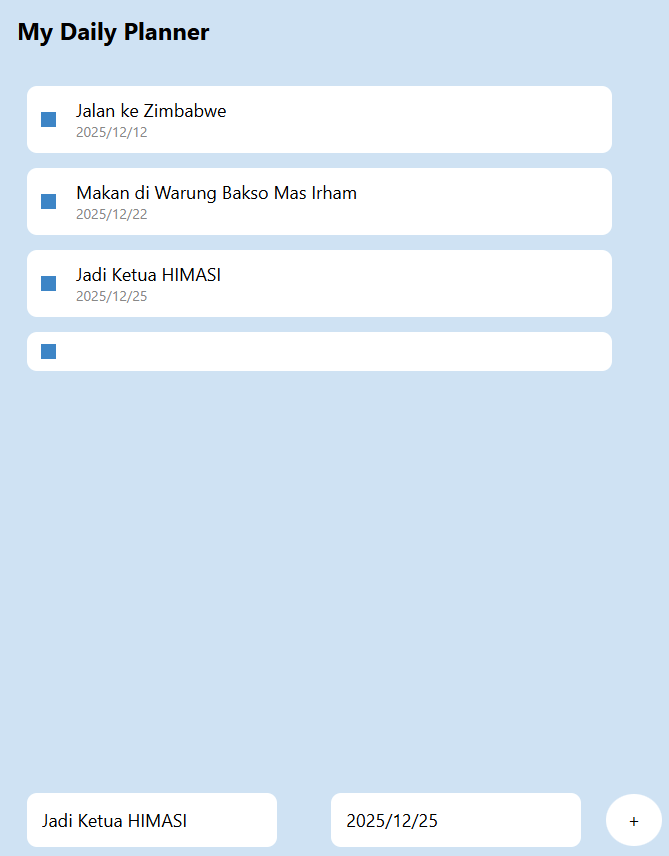

# UAS Pemrograman Perangkat Bergerak Membuat Aplikasi Daily Planner Sederhana

Daily Planner adalah aplikasi mobile yang dibangun dengan React Native yang membantu pengguna mengelola tugas sehari-hari dengan efisien.

## Fitur

- **Manajemen Tugas**: Menambah, mengedit, dan menghapus tugas untuk melacak item yang perlu dilakukan.
- **Tanggal Jatuh Tempo**: Menetapkan tanggal jatuh tempo untuk tugas guna memastikan penyelesaian tepat waktu.
- **Notifikasi**: Menerima pengingat untuk tugas yang akan datang.
- **Kategorisasi**: Mengorganisir tugas ke dalam kategori untuk manajemen yang lebih baik.

## Instalasi

1. **Clone the repository**:

   ```bash
   git clone <Link Projek>
   cd Nama Projek
   ```

2. **Install dependencies**:

```bash
   Copy code
   npm install
```

3.**Start the application**:

```bash
   npx expo start
```

## Teknologi yang digunakan

React Native: Untuk membangun aplikasi mobile.
Expo: Untuk pengembangan dan pembuatan aplikasi.

## Dokumentasi


